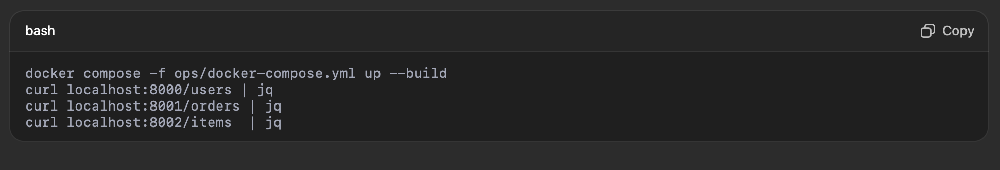

# sre-lab-wil
SRE-Lab — Hands-on Site Reliability Engineering & Observability Project

Welcome to SRE-Lab, a hands-on project designed to simulate real-world Site Reliability Engineering (SRE), observability, and automation practices.

This lab showcases:
	•	Microservices Architecture — containerized services (Python, Node.js, Go) running with Docker/Kubernetes.
	•	Observability & Monitoring — Prometheus + Grafana dashboards, alerts, and logs.
	•	Automation & Infrastructure-as-Code — Terraform for cloud infrastructure, Ansible for configuration management, GitHub Actions CI/CD pipelines.
	•	Resilience Engineering — chaos experiments, self-healing scripts, fault tolerance strategies.
	•	Security & Detection — Suricata IDS, Splunk log analysis, and vulnerability scanning.
	•	Incident Management — RCA templates, postmortems, and operational runbooks.

⸻

🎯 Purpose

This project is both a learning lab and a portfolio showcase. It helps me sharpen practical SRE/DevOps/Cybersecurity skills while demonstrating end-to-end capabilities across:
	•	Cloud (AWS, Azure, GCP)
	•	DevOps/Automation (Terraform, Ansible, CI/CD)
	•	Observability (Grafana, Prometheus, Datadog, Splunk, Nagios)
	•	Resilience & Security (Chaos testing, IDS, incident response)

⸻

0🚀 Getting Started

Clone the repo:

git clone https://github.com/<your-username>/sre-lab-wilnick.git
cd sre-lab-wilnick

un the base services (to be added in upcoming commits):

docker compose up --build

Health check endpoints:
	•	http://localhost:8000/users/health
	•	http://localhost:8001/orders/health
	•	http://localhost:8002/inventory/health

📖 Project Roadmap

This project evolves week by week:
	1.	Microservices & CI setup
	2.	Observability (Prometheus/Grafana)
	3.	Automation (Terraform/Ansible/CI-CD)
	4.	Resilience & Chaos Engineering
	5.	Security (Suricata, Splunk)
	6.	Incident Mgmt & Documentation

Each stage will be documented in docs/ with screenshots, configs, and learnings.

⸻
📂 Repo Structure (planned)

sre-lab-wilnick/
├─ services/        # microservices (users, orders, inventory) 
├─ ops/             # docker-compose, observability, terraform, ansible
├─ security/        # suricata, splunk
├─ incidents/       # runbooks, RCA templates
├─ docs/            # design, observability, SLOs, postmortems
└─ .github/         # CI/CD workflows

📌 Status

🟢 Week 1: 3 services are running with Docker Compose; GitHub CI builds all images..

⸻

👉 This README will evolve as new features (observability, automation, chaos, security) are added.